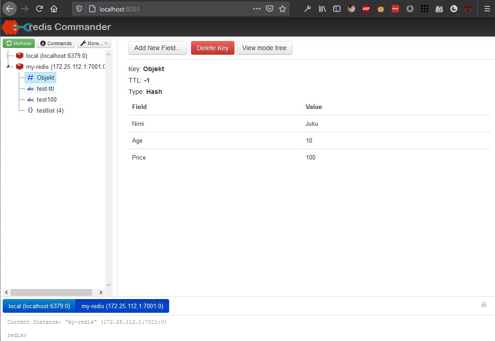

### run redis

`$ docker run -d --rm --name my-redis -p 7001:6379 redis`

### run cli

Replace your local host, example is Docker Deskdop on WSL 2 Windows 10. Ping Pong example.

`$ docker run -it --rm --name my-redis-cli redis redis-cli -h 172.25.112.1 -p 7001`
`$ 172.25.112.1:7001> ping`
`$ PONG`
`$ 172.25.112.1:7001>`

### run redis commander

`$ docker run --rm --name my-redis-commander -d -p 8081:8081 rediscommander/redis-commander`

Open browser: http://localhost:8081/. Add and connect new server.

### python

`$ pip install redis`

`$ python redis_test.py`
